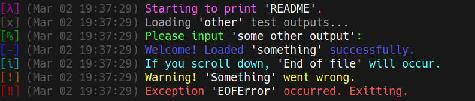

# Logprinter v1.1
#### A library providing a class with methods to print text to the terminal and save text to a log file with levels of priority

## Requirements:
 - Python3 >= v3.13.2 </br>
 - Colorclasses >= v1.0 (must be in the same directory as of now)</br>

## Importing
```python
# Importing the Logprinter class and the LogLevel Enum
from logprinter import Logprinter, LogLevel
# Importing timezone from datetime (optional)
from datetime import timezone
```

## Available log levels:
```python
class LogLevel(Enum):
    DEBUG = 0  # Default for logging to file
    NORMAL = 1  # Default for printing to tty
    PROMPT = 2
    MOTD = 3
    INFO = 4
    WARN = 5
    ERROR = 6
```

## Configuration:
The library provides extensive configuration options on initialization:

```python
"""These are default options for the Logprinter class"""

logprinter = Logprinter(is_printing_enabled: bool = True,
                        # ^- Enable printing to the terminal

                        is_printing_time: bool = True,
                        # ^- Print time for each terminal line

                        print_level: LogLevel = LogLevel.NORMAL,
                        # ^- Minimal log level for tty printing

                        file_log_path_folder: str = None,
                        # ^- Folder for log files. If None, logging to file is disabled

                        file_log_level: LogLevel = LogLevel.DEBUG,
                        # ^- Minimal log level for logging to file

                        is_raising_exceptions: bool = True,
                        # ^- If set to True, will raise exceptions when writing to file fails

                        theme: Theme = DEFAULT_THEME,
                        # ^- Theme for colors and symbols. Defined as a TypedDict of type Theme

                        timezone: timezone = timezone.utc,
                        # ^- Timezone (from datetime) used for printing time and naming log files

                        date_format: str = "%b %d %H:%M:%S"):
                        # ^- Time format for datetime.strftime() used in printing to the terminal
```

## Usage:

> [!TIP]
> Text within single quotes will use the "quote" color from the theme. White by default.


```python
# Initializing with debug messages printing enabled
logprinter = Logprinter(print_level = LogLevel.DEBUG)

logprinter.debug("Starting to print 'README'.")
logprinter.normal("Loading 'other' test outputs...")
logprinter.prompt("Please input 'some other output':")  # Will be implemented with proper input() logging
logprinter.motd("Welcome! Loaded 'something' successfully.")
logprinter.info("If you scroll down, 'End of file' will occur.")
logprinter.warn("Warning! 'Something' went wrong.")
logprinter.error("Exception 'EOFError' occurred. Exitting.")
```

#### Output:


